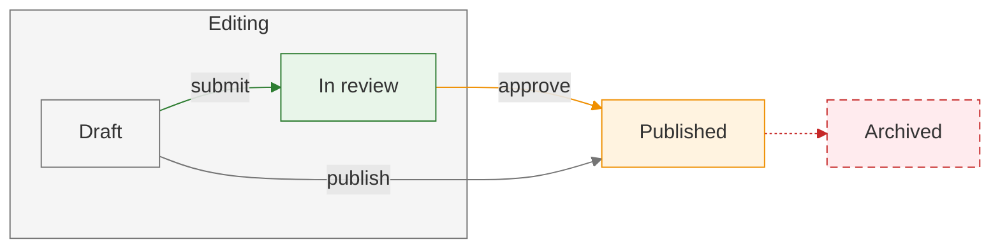

```mermaid
flowchart LR
  subgraph g0["Editing"]
    n0["Draft"]
    n1["In review"]
  end
  n2["Published"]
  n3["Archived"]
  n0 -->|"submit"| n1
  n1 -->|"approve"| n2
  n0 -->|"publish"| n2
  n2 -.-> n3
  classDef added fill:#e8f5e9,stroke:#2e7d32
  classDef removed fill:#ffebee,stroke:#c62828,stroke-dasharray:6 4
  classDef unchanged fill:#f5f5f5,stroke:#757575
  classDef mismatch fill:#fff3e0,stroke:#ef8f00
  class g0 unchanged
  class n0 unchanged
  class n1 added
  class n2 mismatch
  class n3 removed
  linkStyle 0 stroke:#2e7d32
  linkStyle 1 stroke:#ef8f00
  linkStyle 2 stroke:#757575
  linkStyle 3 stroke:#c62828
```
